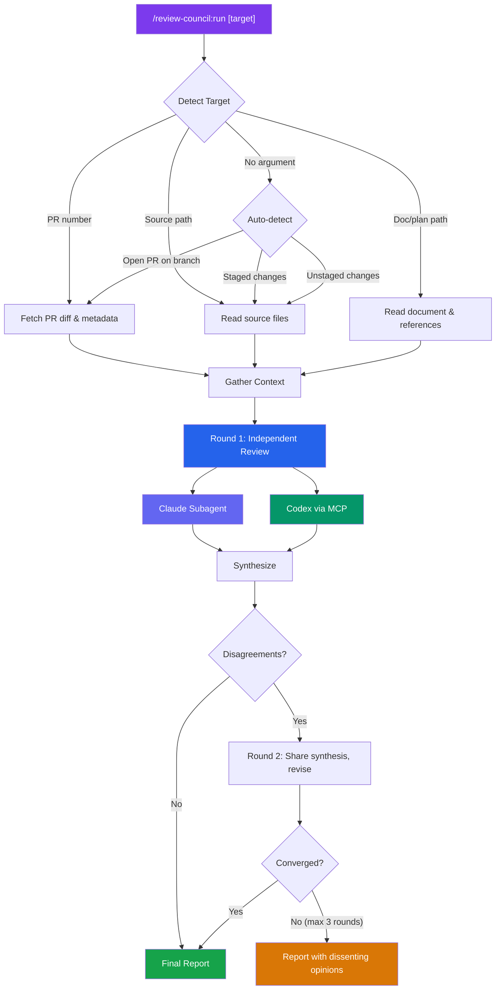
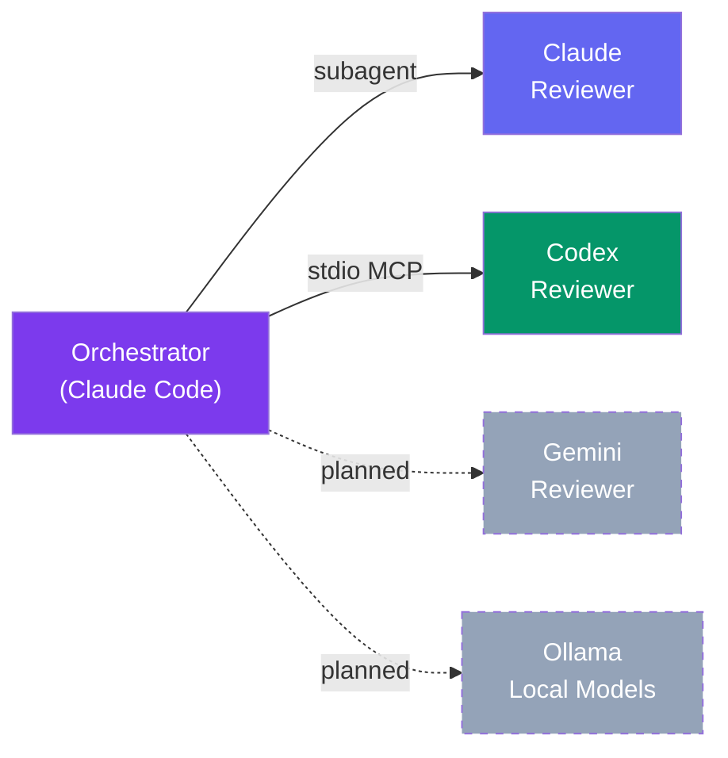
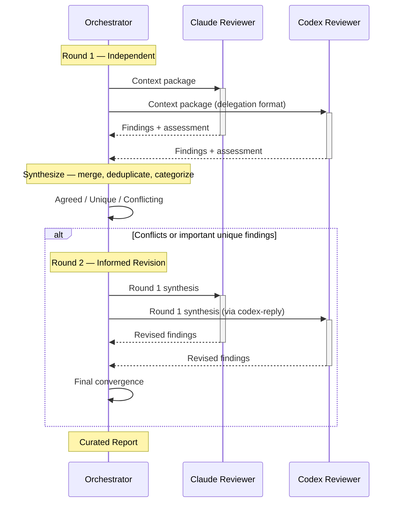
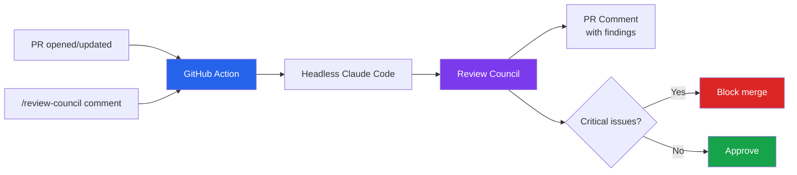
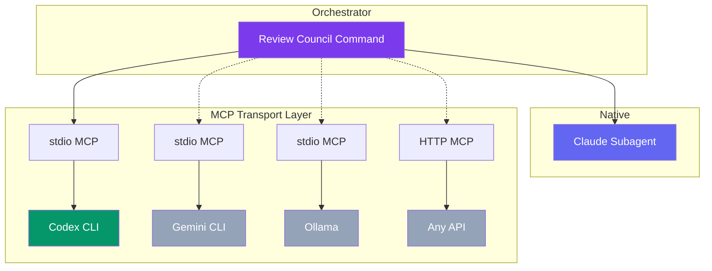

# Review Council

Multi-agent convergence review for Claude Code. Multiple AI models independently review your PR, code, or plan — then discuss until they converge on a curated list of what actually needs changing.

## Why

Single-model code review has blind spots. Different models catch different things. Review Council runs multiple reviewers in parallel, compares their findings, and produces a single curated report where:

- **Agreed findings** (both reviewers flagged) = high confidence
- **Unique findings** (one reviewer) = worth considering
- **Conflicts** (reviewers disagree) = both perspectives documented

The result: fewer false positives, broader coverage, and a clear priority order.

## Quick Start

```bash
# Install the plugin
/plugin marketplace add deployhq/review-council
/plugin install review-council

# Configure Codex as second reviewer
/review-council:setup

# Review something
/review-council:run              # auto-detect: current PR or staged changes
/review-council:run 42           # review PR #42
/review-council:run src/auth.ts  # review a source file
/review-council:run docs/plan.md # review a plan or document
```

## How It Works



**Auto-detection** means you usually just run `/review-council:run` with no arguments. It checks for an open PR on the current branch, then staged changes, then unstaged changes.

## Reviewers



| Reviewer | Transport | Status |
|----------|-----------|--------|
| **Claude** | Native subagent with dedicated reviewer persona | Available |
| **Codex** (OpenAI) | Codex MCP server (stdio) | Available |
| **Gemini** | Gemini MCP (planned) | Roadmap |
| **Ollama** | Local model MCP (planned) | Roadmap |

Without Codex configured, Review Council runs in **single-reviewer mode** — still useful as a structured review with a dedicated persona, but you lose the cross-model validation.

## Setup

### Prerequisites

- [Claude Code](https://claude.ai/code) CLI
- [Codex CLI](https://github.com/openai/codex) — `npm install -g @openai/codex && codex login`
- [GitHub CLI](https://cli.github.com/) (`gh`) — for PR reviews (optional)

### Install

```bash
/plugin marketplace add deployhq/review-council
/plugin install review-council
/review-council:setup
```

The setup command will:
1. Verify Codex CLI is installed and authenticated
2. Configure the Codex MCP server in `~/.claude/settings.json`
3. Verify GitHub CLI for PR reviews (optional)

Restart Claude Code after setup for MCP changes to take effect.

### Uninstall

```bash
/review-council:uninstall    # Remove MCP configuration
/plugin uninstall review-council
```

## Output Example

```
## Review Council Report

**Target:** PR #42 — "Add rate limiting to API endpoints"
**Type:** PR
**Reviewers:** Claude, Codex
**Rounds:** 2
**Consensus:** Strong

### Critical Issues

1. **[critical] [high]** — `src/middleware/rate-limit.ts:28`
   - Issue: Rate limit counter uses in-memory store — resets on every deploy
   - Why: Users get full quota back on each deployment, defeating the purpose
   - Fix: Use Redis or PostgreSQL for counter storage

### Important Findings

2. **[important] [high]** — `src/middleware/rate-limit.ts:15`
   - Issue: Rate limit key uses IP only — shared IPs (corporate NAT) throttle all users
   - Why: Enterprise customers behind NAT will hit limits quickly
   - Fix: Use authenticated user ID as primary key, fall back to IP for anonymous

3. **[important] [medium]** — `src/routes/api.ts:44`
   - Issue: Rate limit headers (X-RateLimit-Remaining) not included in responses
   - Why: Clients can't implement backoff without knowing their remaining quota
   - Fix: Add standard rate limit headers per RFC 6585

### Suggestions

4. **[suggestion] [medium]** — `docs/api.md`
   - Issue: No documentation of rate limit behavior for API consumers
   - Fix: Add rate limits section to API docs

### What's Done Well
- Clean middleware pattern — easy to adjust limits per route
- Good test coverage for the happy path
```

## Architecture

### Plugin Structure

```
review-council/
├── .claude-plugin/
│   ├── plugin.json          # Plugin metadata
│   └── marketplace.json     # Marketplace listing
├── commands/
│   ├── run.md               # Main command (orchestrator)
│   ├── setup.md             # Setup wizard
│   └── uninstall.md         # Cleanup
├── agents/
│   └── reviewer-claude.md   # Claude reviewer persona
├── rules/
│   ├── orchestration.md     # Convergence logic docs
│   └── delegation-format.md # External model prompt format
├── CLAUDE.md                # Plugin instructions
├── LICENSE                  # MIT
└── README.md                # This file
```

### Convergence Rounds



### Design Decisions

**Why parallel independent reviews?** If reviewers see each other's output, they anchor on the first response. Independent review ensures genuinely different perspectives, then convergence rounds resolve differences.

**Why a structured delegation format?** Different models have different defaults. The 7-section format (TASK, CONTEXT, EXPECTED OUTCOME, CONSTRAINTS, MUST DO, MUST NOT DO, OUTPUT FORMAT) forces consistent, comparable output regardless of the model.

**Why max 3 rounds?** Research shows rounds 1-2 catch 90%+ of issues. Round 3 has diminishing returns. Beyond 3 rounds, unresolved disagreements are better presented as "dissenting opinions" than debated further.

**Why filter aggressively?** The biggest failure mode of AI code review is noise — too many low-value findings. Review Council filters: confidence scoring from agreement, severity thresholds, and explicit rules against style nitpicks.

## GitHub Actions (Roadmap)

Review Council can be triggered from CI as a reusable GitHub Action workflow — similar to [claude-fix-pr](https://github.com/deployhq/claude-fix-pr).



This is planned for a future release.

## Adding New Reviewers (Extensibility)

The architecture supports any model accessible via MCP:



Adding a new reviewer requires:
- Transport config in the setup command
- Model-specific prompt adjustments (if needed)
- No changes to orchestration logic

The delegation format in `rules/delegation-format.md` ensures consistent, comparable output across all providers.

## Contributing

1. Fork the repo
2. Create a feature branch
3. Test with `/review-council:run` on real PRs/code
4. Submit a PR

## License

MIT - see [LICENSE](LICENSE).
