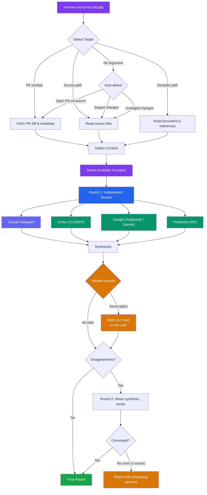
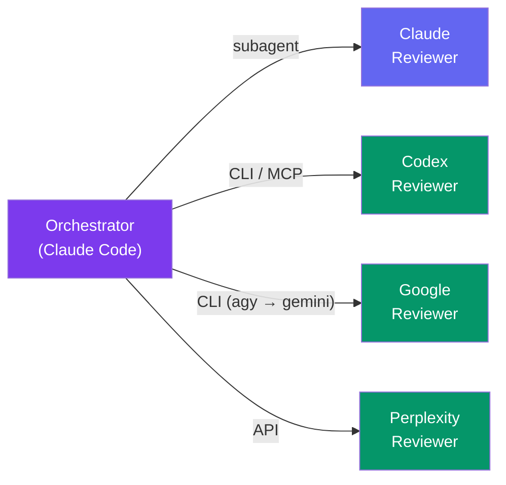
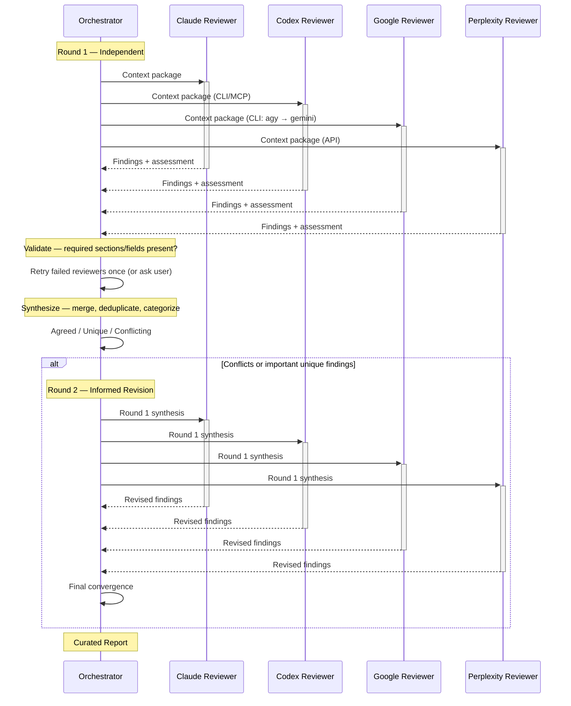
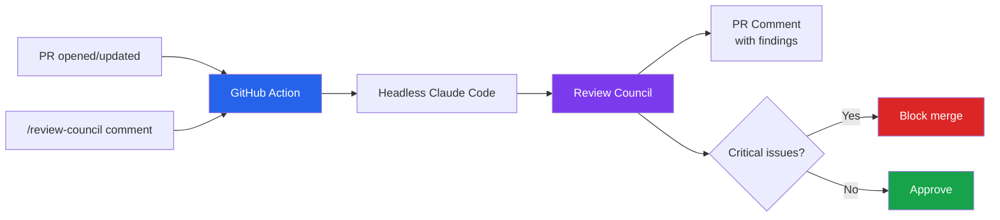
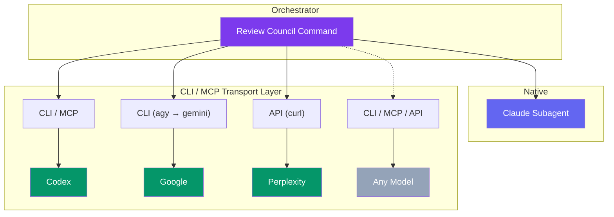

# Review Council

Multi-agent convergence review for Claude Code. Multiple AI models independently review your PR, code, or plan — then discuss until they converge on a curated list of what actually needs changing.

## Why

Single-model code review has blind spots. Different models catch different things. Review Council runs multiple reviewers in parallel, compares their findings, and produces a single curated report where:

- **Agreed findings** (multiple reviewers flagged) = high confidence
- **Unique findings** (one reviewer) = worth considering
- **Conflicts** (reviewers disagree) = both perspectives documented

The result: fewer false positives, broader coverage, and a clear priority order.

## Quick Start

```bash
# Install the plugin
/plugin marketplace add deployhq/review-council
/plugin install review-council

# Check available providers
/review-council:setup

# Review something
/review-council:run              # auto-detect: current PR or staged changes
/review-council:run 42           # review PR #42
/review-council:run src/auth.ts  # review a source file
/review-council:run docs/plan.md # review a plan or document
```

## How It Works



**Auto-detection** means you usually just run `/review-council:run` with no arguments. It checks for an open PR on the current branch, then staged changes, then unstaged changes.

**Output validation.** After Round 1, each reviewer's response is checked for required sections and fields. Malformed responses are retried once; if still failing, the orchestrator asks whether to proceed with the remaining reviewers or abort. Set `RC_AUTO_RETRY=true` to skip the prompt (useful in CI).

## Reviewers



| Reviewer | Transport | Detection |
|----------|-----------|-----------|
| **Claude** | Native subagent | Always available |
| **Codex** (OpenAI) | CLI (`codex exec`) / MCP fallback | `which codex` or MCP tool |
| **Google** (Antigravity / Gemini) | CLI — `agy` preferred, `gemini` fallback | `which agy` or `which gemini` |
| **Perplexity** | Sonar API (`curl`) | `PERPLEXITY_API_KEY` env var |

Minimum 2 reviewers needed for convergence mode. With only Claude, runs in single-reviewer mode. Providers are auto-detected at runtime — no manual configuration needed.

**Google slot:** Antigravity (`agy`) and Gemini (`gemini`) run the same Gemini model family, so they share **one** reviewer slot. When both are installed, `agy` runs and `gemini` is the fallback — never two Google votes. Google's consumer Gemini CLI "Sign in with Google" was [sunset on 2026-06-18](https://developers.googleblog.com/an-important-update-transitioning-gemini-cli-to-antigravity-cli/) in favor of the Antigravity CLI; Gemini CLI still works with a `GEMINI_API_KEY`, Vertex AI, or an enterprise Code Assist license.

## Setup

### Prerequisites

- [Claude Code](https://claude.ai/code) CLI
- [GitHub CLI](https://cli.github.com/) (`gh`) — for PR reviews (optional)
- At least one additional reviewer for convergence mode:
  - [Codex CLI](https://github.com/openai/codex) — `npm install -g @openai/codex && codex login`
  - [Antigravity CLI](https://antigravity.google) (`agy`) — `curl -fsSL https://antigravity.google/cli/install.sh | bash` (preferred Google reviewer)
  - [Gemini CLI](https://github.com/google-gemini/gemini-cli) — `npm install -g @google/gemini-cli` (fallback; needs `GEMINI_API_KEY`, Vertex, or an enterprise Code Assist license — consumer "Sign in with Google" was sunset 2026-06-18)
  - [Perplexity API key](https://www.perplexity.ai/) — set `PERPLEXITY_API_KEY` env var

### Install

```bash
/plugin marketplace add deployhq/review-council
/plugin install review-council
```

Providers are auto-detected at runtime. Run `/review-council:setup` to check which providers are available.

### Configuration

Optional environment variables for tuning behavior:

| Variable | Default | Purpose |
|----------|---------|---------|
| `RC_MIN_REVIEWERS` | `2` | Minimum successful reviewers required for council mode |
| `RC_AUTO_RETRY` | `false` | If `true`, retry failed reviewers without asking (CI-friendly) |
| `RC_CLAUDE_MAX_TURNS` | `30` | Max turns for the Claude reviewer subagent |
| `RC_REVIEWER_TIMEOUT` | `300` | Per-invocation wall-clock cap (seconds) for CLI/API reviewers |
| `PERPLEXITY_API_KEY` | — | Enables Perplexity reviewer via Sonar API |

### Uninstall

```bash
/review-council:uninstall    # Prompts to remove Codex MCP server entry from ~/.claude/settings.json
/plugin uninstall review-council
```

## Output Example

```
## Review Council Report

**Target:** PR #42 — "Add rate limiting to API endpoints"
**Type:** PR
**Reviewers:** Claude, Codex, Antigravity (3 of 4 — Perplexity: PERPLEXITY_API_KEY not set)
**Rounds:** 2
**Consensus:** Strong

### Critical Issues

1. **[critical] [high]** — `src/middleware/rate-limit.ts:28`
   - Issue: Rate limit counter uses in-memory store — resets on every deploy
   - Why: Users get full quota back on each deployment, defeating the purpose
   - Fix: Use Redis or PostgreSQL for counter storage

### Important Findings

2. **[important] [high]** — `src/middleware/rate-limit.ts:15`
   - Issue: Rate limit key uses IP only — shared IPs (corporate NAT) throttle all users
   - Why: Enterprise customers behind NAT will hit limits quickly
   - Fix: Use authenticated user ID as primary key, fall back to IP for anonymous

3. **[important] [medium]** — `src/routes/api.ts:44`
   - Issue: Rate limit headers (X-RateLimit-Remaining) not included in responses
   - Why: Clients can't implement backoff without knowing their remaining quota
   - Fix: Add standard rate limit headers per RFC 6585

### Suggestions

4. **[suggestion] [medium]** — `docs/api.md`
   - Issue: No documentation of rate limit behavior for API consumers
   - Fix: Add rate limits section to API docs

### What's Done Well
- Clean middleware pattern — easy to adjust limits per route
- Good test coverage for the happy path
```

## Architecture

### Plugin Structure

```
review-council/
├── .claude-plugin/
│   ├── plugin.json          # Plugin metadata
│   └── marketplace.json     # Marketplace listing
├── skills/
│   ├── run/SKILL.md         # Main command (orchestrator)
│   ├── setup/SKILL.md       # Provider status checker
│   └── uninstall/SKILL.md   # Cleanup
├── agents/
│   └── reviewer-claude.md   # Claude reviewer persona
├── rules/
│   ├── orchestration.md     # Convergence logic, validation, env vars
│   ├── delegation-format.md # External model prompt format
│   └── providers.md         # Provider registry
├── CLAUDE.md                # Plugin instructions
├── LICENSE                  # MIT
└── README.md                # This file
```

### Convergence Rounds



### Design Decisions

**Why parallel independent reviews?** If reviewers see each other's output, they anchor on the first response. Independent review ensures genuinely different perspectives, then convergence rounds resolve differences.

**Why a structured delegation format?** Different models have different defaults. The delegation format (TASK, REVIEW PROCESS, CONTEXT, EXPECTED OUTCOME, CONSTRAINTS, MUST DO, MUST NOT DO, OUTPUT FORMAT) forces consistent, comparable output regardless of the model. See `rules/delegation-format.md` for the full template.

**Why max 3 rounds?** Research shows rounds 1-2 catch 90%+ of issues. Round 3 has diminishing returns. Beyond 3 rounds, unresolved disagreements are better presented as "dissenting opinions" than debated further.

**Why filter aggressively?** The biggest failure mode of AI code review is noise — too many low-value findings. Review Council filters: confidence scoring from agreement, severity thresholds, and explicit rules against style nitpicks.

## GitHub Actions (Roadmap)

Review Council can be triggered from CI as a reusable GitHub Action workflow — similar to [claude-fix-pr](https://github.com/deployhq/claude-fix-pr).



This is planned for a future release.

## Adding New Reviewers (Extensibility)

The architecture supports any model accessible via CLI or API:



Adding a new reviewer requires adding an entry to `rules/providers.md` with detection, CLI invocation, MCP fallback, and env requirements. Then update `skills/run/SKILL.md` to include it in the parallel dispatch.

The delegation format in `rules/delegation-format.md` ensures consistent, comparable output across all providers. Transport is CLI-primary with MCP fallback — see the provider registry for details.

## Contributing

1. Fork the repo
2. Create a feature branch
3. Test with `/review-council:run` on real PRs/code
4. Submit a PR

## License

MIT - see [LICENSE](LICENSE).
