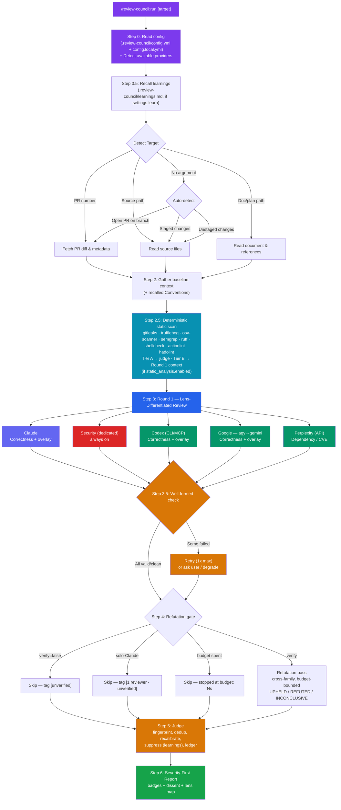
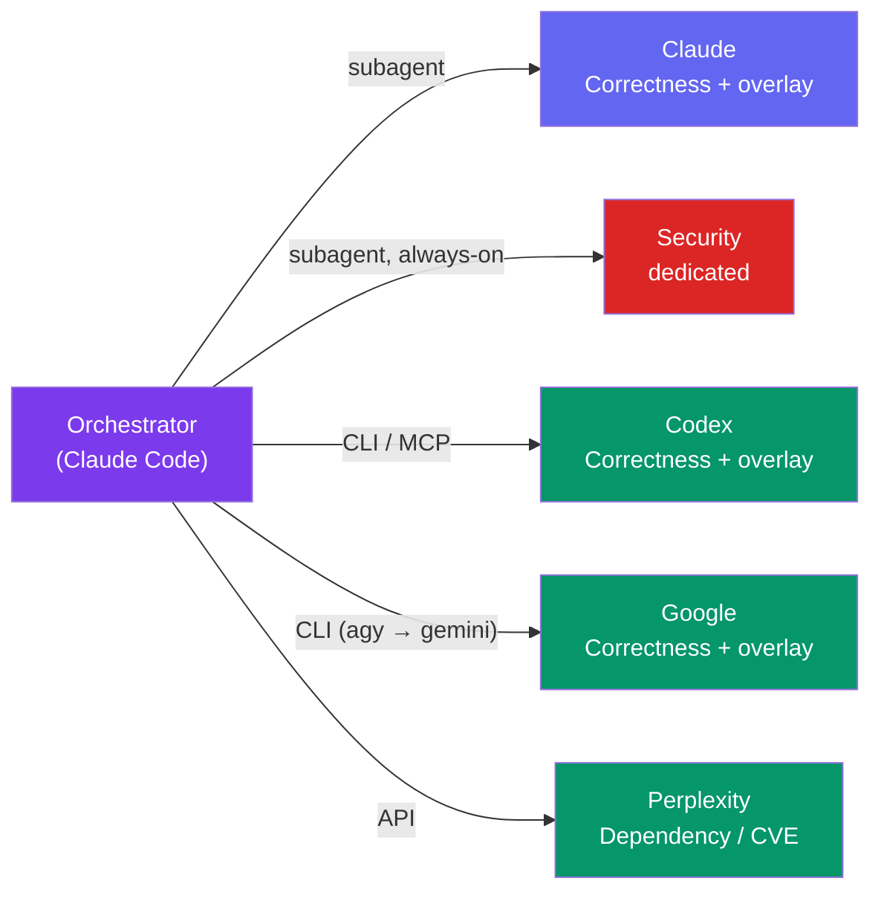
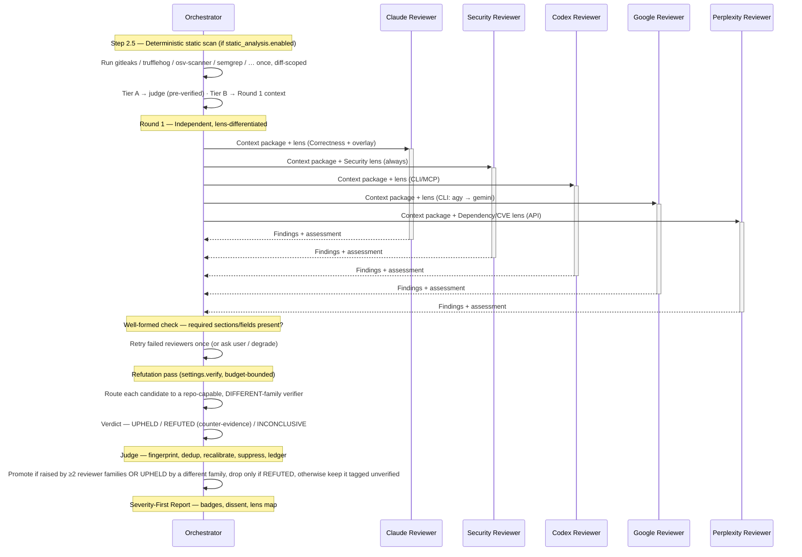
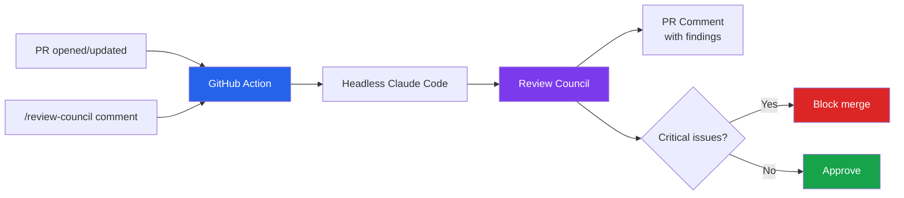
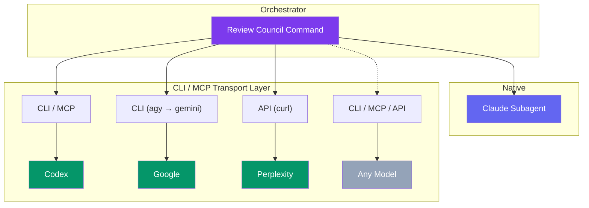

# Review Council

<!-- rc:description:start -->
Multi-agent code review for Claude Code. Multiple AI models review your PR, code, or plan independently; a cross-family refutation pass and an active judge then distill the findings into a curated, severity-ranked list of what actually needs changing.
<!-- rc:description:end -->

## Why

Single-model code review has blind spots. Different models catch different things. Review Council runs multiple reviewers in parallel, compares their findings, and produces a single curated report where:

- **Cross-reviewed findings** (raised by multiple reviewer families, or independently upheld by a different-family refutation pass) = high confidence, badged `[cross-reviewed]`
- **Single-reviewer findings** (one reviewer, not yet cross-verified) = worth considering, badged `[unverified]` or `[1 reviewer · unverified]` — never silently dropped for being unverified
- **Genuine disagreements** (a reviewer's counter-evidence refutes another's finding, or an unresolved conflict survives the judge) = documented as a dropped/refuted finding or a Dissenting Opinion, not just discarded

The result: fewer false positives, broader coverage, and a clear priority order. Review Council is orchestrated locally, inside a single Claude Code session, and only ever prints a report — it never pushes commits, opens PRs, or posts PR comments on its own (see [GitHub Actions (Roadmap)](#github-actions-roadmap) for a possible future CI mode). Note the data egress this implies: when Codex, Google, or Perplexity are enabled, the gathered review context (diff, file contents, etc.) is sent to those third-party tools/APIs — only Claude (the native subagent) stays fully local.

## Quick Start

```bash
# Install the plugin
/plugin marketplace add deployhq/review-council
/plugin install review-council

# Check available providers
/review-council:setup

# Review something
/review-council:run              # auto-detect: current PR or staged changes
/review-council:run 42           # review PR #42
/review-council:run src/auth.ts  # review a source file
/review-council:run docs/plan.md # review a plan or document
```

## How It Works



**Auto-detection** means you usually just run `/review-council:run` with no arguments. It checks for an open PR on the current branch, then staged changes, then unstaged changes.

**Well-formed check (Step 3.5).** After Round 1, each reviewer's response is checked for required sections and fields (the finding schema: `severity`, `confidence`, `location`, `symbol`, `concern`, `issue`, `why_it_matters`, `recommendation`, `how_to_verify`, `source`) — a structural check, not a truth check. Malformed responses are retried once; if still failing, the orchestrator asks whether to proceed with the remaining reviewers or abort. Set `settings.auto_retry: true` (env: `RC_AUTO_RETRY=true`) to skip the prompt (useful in CI).

**Refutation pass (Step 4).** Gated on `settings.verify` (default on). Each candidate finding is routed to an isolated, different-family verifier — one that never sees the synthesis or any other reviewer's opinion, only the finding and the actual code — which returns **UPHELD** (positive supporting evidence), **REFUTED** (positive counter-evidence it's not a bug), or **INCONCLUSIVE** (can't decide; absence of proof is *never* REFUTED). Skipped entirely in solo-Claude mode, or once the run budget is spent — see [Verification & Badges](#verification--badges).

**Judge (Step 5).** A single active judge computes a canonical fingerprint per finding, deduplicates across models, and recalibrates severity/confidence: +1 tier when a finding was raised by ≥2 reviewer families *or* UPHELD by a different family, drop only when REFUTED with counter-evidence, keep-and-tag `[unverified]` when INCONCLUSIVE or unverified. A single-reviewer `critical` is never demoted for being unverified — it stays Critical, tagged `[1 reviewer · unverified]`. The judge also suppresses findings matching a learnings Suppression and emits a per-finding ledger before the prose report.

## Reviewers



| Reviewer | Transport | Detection |
|----------|-----------|-----------|
| **Claude** | Native subagent | Always available |
| **Security** | Native subagent (dedicated) | Always available — runs regardless of which external providers are present |
| **Codex** (OpenAI) | CLI (`codex exec`) / MCP fallback | `which codex` or MCP tool |
| **Google** (Antigravity / Gemini) | CLI — `agy` preferred, `gemini` fallback | `which agy` or `which gemini` |
| **Perplexity** | Sonar API (`curl`) | `PERPLEXITY_API_KEY` env var |

Minimum 2 reviewers needed for council mode (`settings.min_reviewers`, default 2). Claude and the dedicated Security reviewer are both native and always run, but they are the **same model family (Claude)** — council mode and the refutation pass need at least one reviewer from a **different family** (Codex, Google, or Perplexity) to cross-verify against. With only Claude-family reviewers (Claude + Security) available, the run proceeds in single-reviewer mode. Providers are auto-detected at runtime — no manual configuration needed.

**Lens-differentiated Round 1.** Every reviewer is assigned a lens before dispatch: the dedicated Security reviewer always carries the Security lens; every repo-capable frontier reviewer (Claude, Codex, Google) carries Correctness & concurrency as its core, plus one diff-aware specialist overlay chosen from what actually changed (Cross-file/API-contract, Performance & reliability, Design & maintainability, Data-integrity & migration, Config/workflow, or UI-state & accessibility); tool-less Perplexity always carries Dependency/CVE/best-practices. **Lens = emphasis, not blinders** — every reviewer still flags any critical issue it notices outside its lens. The chosen lens map is printed before Round 1 and again in the final report header. `.review-council/config.yml` can pin a lens to specific providers or disable it (see [Configuration](#configuration)); `settings.personas: false` reverts every reviewer to the identical legacy (non-lens) prompt.

**Google slot:** Antigravity (`agy`) and Gemini (`gemini`) run the same Gemini model family, so they share **one** reviewer slot. Whenever `agy` is installed it is the primary Google reviewer (labeled **Google (Antigravity)**) and `gemini` is only a last-resort fallback — never two Google votes. Google's consumer Gemini CLI "Sign in with Google" was [sunset on 2026-06-18](https://developers.googleblog.com/an-important-update-transitioning-gemini-cli-to-antigravity-cli/) in favor of the Antigravity CLI; Gemini CLI still works with a `GEMINI_API_KEY`, Vertex AI, or an enterprise Code Assist license.

Two behaviors keep the Google slot robust:

- **`agy` cold start.** `agy`'s first `-p` call in a session can take **several minutes** (model load + auth handshake + update check) versus ~10s once warm, and can occasionally exit `0` with no output. The council gives it real headroom — the per-reviewer cap `RC_REVIEWER_TIMEOUT` (10 min default) *and* agy's own `--print-timeout` are both sized to cover the cold start — and **retries `agy` once** on an empty result before doing anything else. So a slow or empty first call recovers on its own instead of losing the slot.
- **`gemini` is a dead end for Google Workspace accounts.** `gemini -p` fast-fails with `IneligibleTierError` (`DASHER_USER`, "not eligible for Gemini Code Assist for individuals") for any Workspace/managed (`@your-company`) account — install `agy` to use the Google slot on those. Because that fallback can never succeed on a Workspace account, the council no longer lets an `agy` hiccup silently fall through to a confusing "Gemini auth failure": Google-slot failures are reported attributed to the primary tool (`agy`), with the `gemini` ineligibility noted separately.

## Setup

### Prerequisites

- [Claude Code](https://claude.ai/code) CLI
- [GitHub CLI](https://cli.github.com/) (`gh`) — for PR reviews (optional)
- At least one additional reviewer for council mode:
  - [Codex CLI](https://github.com/openai/codex) — `npm install -g @openai/codex && codex login`
  - [Antigravity CLI](https://antigravity.google) (`agy`) — `curl -fsSL https://antigravity.google/cli/install.sh | bash` (preferred Google reviewer)
  - [Gemini CLI](https://github.com/google-gemini/gemini-cli) — `npm install -g @google/gemini-cli` (fallback; needs `GEMINI_API_KEY`, Vertex, or an enterprise Code Assist license — consumer "Sign in with Google" was sunset 2026-06-18)
  - [Perplexity API key](https://www.perplexity.ai/) — set `PERPLEXITY_API_KEY` env var

### Install

```bash
/plugin marketplace add deployhq/review-council
/plugin install review-council
```

Providers are auto-detected at runtime. Run `/review-council:setup` to check which providers are available.

### Optional dependencies

- **[yq](https://github.com/mikefarah/yq) (mikefarah v4)** — enables the optional config file (`.review-council/config.yml`). Run `/review-council:setup` and, with your consent, it will install `yq` for you; or install it yourself with `brew install yq` (macOS) or see the [yq install guide](https://github.com/mikefarah/yq#install). **Without `yq`, config files are ignored and the plugin runs on built-in defaults + `RC_*` env overrides** — still fully functional. (Heads-up: a *different* Python tool is also named `yq`; Review Council needs **mikefarah/yq**, whose `yq --version` prints a `github.com/mikefarah/yq` URL.)
- **[bats](https://github.com/bats-core/bats-core) + yq** — only for running the unit-test suite (`bats tests/unit/`); not needed to use the plugin.

### Configuration

Review Council works with **zero configuration**. Optionally, add a `.review-council/config.yml` to the repo to control the reviewer roster, review lenses, and run settings; a gitignored `.review-council/config.local.yml` holds per-machine overrides. Precedence is applied **per key**: **env > config.local.yml > config.yml > built-in default**. `/review-council:setup` can scaffold both files, and the full schema (including the `reviewers:` and `lenses:` blocks) is documented in [`rules/config.md`](rules/config.md). Config files are parsed with `yq` (see Optional dependencies above); without it the plugin falls back to defaults + the environment variables below.

Each run setting (`settings.*`) is also tunable via its `RC_*` environment variable (env wins over both config files); the full list is in [`rules/config.md`](rules/config.md). All of them:

| Variable | Default | Purpose |
|----------|---------|---------|
| `RC_PERSONAS` | `true` | Use reviewer lenses/personas when prompting reviewers; `false` reverts to the identical legacy (non-lens) prompt for every reviewer |
| `RC_VERIFY` | `true` | Run the refutation pass over candidate findings |
| `RC_VERIFY_CAP` | `12` | Cap on findings sent to the refutation pass (top by severity; the rest ship `[unverified]`) |
| `RC_LEARN` | `true` | Enable learnings recall (Step 0.5) and, in a later phase, capture |
| `RC_MIN_REVIEWERS` | `2` | Minimum successful reviewers required for council mode |
| `RC_REVIEWER_TIMEOUT` | `600` | **Hard** per-invocation wall-clock cap (**seconds**, 10 min) for CLI/API reviewers; sized to cover `agy`'s multi-minute cold start (`agy`'s own `--print-timeout` is raised to match, as a unit-suffixed duration like `600s`/`10m`). Raise for very large diffs or slow networks. |
| `RC_RUN_BUDGET` | `600` | **Soft** total wall-clock budget (**seconds**) for the whole run — see "The two-cap model" below |
| `RC_AUTO_RETRY` | `false` | If `true`, retry failed reviewers without asking (CI-friendly) |
| `RC_CLAUDE_MAX_TURNS` | `30` | Max turns for the Claude/Security reviewer subagents (not part of the config schema — read directly) |
| `PERPLEXITY_API_KEY` | — | Enables Perplexity reviewer via Sonar API |

**The two-cap model.** Review Council bounds time with two independent caps, not one:

- **`reviewer_timeout_seconds` (hard, per-call).** Every individual CLI/API reviewer invocation is wrapped so it can never hang forever (`timeout`/`gtimeout`, or a pure-shell watchdog if neither is installed). A single stuck or overloaded provider fails in minutes, not tens of minutes.
- **`run_budget_seconds` (soft, whole run).** After each capped stage (Round 1, the refutation pass), the orchestrator sums the *measured elapsed* time those invocations actually took. If the budget is already spent, it **degrades rather than aborts** — skipping or shrinking the refutation pass, tagging the affected findings `[unverified]`, and printing `stopped at budget: <n>s` — then goes straight to the judge so a report is always produced.

### Learnings

Review Council can read a repo's shared, checked-in `.review-council/learnings.md` to make each run informed by past decisions (capture — automatically writing to this file — lands in a later phase; today it is recall-only). Gated on `settings.learn` (`RC_LEARN`, default on). The file has two sections:

- **Conventions** — project-specific rules about what not to flag (e.g. "Migrations are auto-generated; do not flag missing down-migrations"). Folded once into the shared Step-2 baseline context package, so every reviewer sees it.
- **Suppressions** — known false positives keyed by fingerprint (e.g. `src/adapters/*::*::unchecked-any | reason: intentional, see ADR-012`). Held for the judge (Step 5), which suppresses any surviving finding whose fingerprint matches and reports `Suppressions applied: N`.

If the file is absent, both are skipped silently — a missing `learnings.md` is the normal case, not a warning.

### Verification & Badges

When `settings.verify` is on and more than one reviewer family is available, Round 1 findings go through an isolated **refutation pass** (Step 4) before the judge: each candidate finding is routed to a repo-capable reviewer from a **different** family than the one that raised it (never to tool-less Perplexity), which returns one verdict — **UPHELD**, **REFUTED** (with positive counter-evidence), or **INCONCLUSIVE** — without ever seeing the synthesis or other reviewers' output. Absence of proof is always INCONCLUSIVE, never REFUTED.

The judge (Step 5) turns those verdicts into the badges shown in the final report:

| Badge | Meaning |
|---|---|
| `[verified]` | A Tier A static-analysis finding (pre-verified secret/CVE), or a Tier B finding an LLM reviewer corroborated on the same (judge-computed) fingerprint — see [Static Analysis](#static-analysis-phase-2-step-25) |
| `[cross-reviewed]` | Raised by ≥2 reviewer families, or UPHELD by a different-family verifier |
| `[1 reviewer · unverified]` | A single reviewer raised it and it wasn't (yet) cross-verified — critical findings are **never** demoted out of Critical for this |
| `[unverified]` | Not verified this run — over the `verify_max_findings` cap, or the run budget was spent before verification (solo-Claude findings get `[1 reviewer · unverified]` instead) |

Badge precedence when more than one could apply: `[verified]` > `[cross-reviewed]` > `[1 reviewer · unverified]` > `[unverified]` — the strongest badge is shown; others are noted in prose where relevant.

### Static Analysis (Phase 2, Step 2.5)

Between gathering context (Step 2) and Round 1, Review Council can run a deterministic static-analysis layer — grounded evidence for the council, not a second vote. Gated on `static_analysis.enabled` (default on); when it runs, one subagent probes up to eight external tools and diff-scopes each one that's present and applicable:

| Tool | Tier | Catches | Install |
|---|---|---|---|
| [`gitleaks`](https://github.com/gitleaks/gitleaks) | A — secrets | Hardcoded secrets (regex/entropy rules) | `brew install gitleaks` |
| [`trufflehog`](https://github.com/trufflesecurity/trufflehog) | A — secrets, live-verified | Secrets, confirmed live against the provider | `brew install trufflehog` (or the official install script) |
| [`osv-scanner`](https://github.com/google/osv-scanner) | A — known CVEs | Known-vulnerable dependencies in lockfiles | `brew install osv-scanner` |
| [`semgrep`](https://semgrep.dev/) | B — SAST | Broad static-analysis rule coverage | `brew install semgrep` (or `pipx install semgrep`) |
| [`ruff`](https://github.com/astral-sh/ruff) | B — Python lint | Python lint/style issues | `brew install ruff` (or `pipx install ruff` / `uvx ruff`) |
| [`shellcheck`](https://www.shellcheck.net/) | B — shell lint | Shell-script bugs and pitfalls | `brew install shellcheck` |
| [`actionlint`](https://github.com/rhysd/actionlint) | B — CI lint | GitHub Actions workflow errors | `brew install actionlint` |
| [`hadolint`](https://github.com/hadolint/hadolint) | B — Dockerfile lint | Dockerfile best-practice violations | `brew install hadolint` |

**The two-tier model:**

- **Tier A — verified / high-precision.** Secrets and known-CVE hits go straight into the report, pre-verified, badged `[verified]`, exempt from the suggestion cap, and never downgraded by the judge — severity is *inherited* from the tool, not judge-assigned. (`gitleaks` is precision-by-rule — regex/entropy — not live-verified the way `trufflehog` is; still high-precision, just a different guarantee.)
- **Tier B — SAST/lint, context not a verdict.** Findings are folded into Round 1's shared context under "PRE-EXISTING STATIC-ANALYSIS SIGNALS — corroborate or dismiss." Every reviewer sees them; a reviewer match on the same (judge-computed) fingerprint promotes the finding to `[verified]`, while a tool-only hit survives only as a capped `suggestion` badged `[tool-only:<rule>]` — never Critical/Important on tool say-so alone.

Static analysis is never a voting reviewer: no lens, doesn't count toward `min_reviewers`, never routed through the refutation pass. Only repo-owned tool configuration is ever used (`.gitleaks.toml`, `.semgrep.yml`, etc., already committed to the target repo) — a PR-supplied tool config or ruleset is never fetched or executed, the direct lesson from the CodeRabbit-config-RCE precedent this project deliberately avoids repeating.

**Config keys** (`.review-council/config.yml`, precedence `env > config.local.yml > config.yml > default` — full schema in [`rules/config.md`](rules/config.md)):

| Key | Default | Env override | Purpose |
|---|---|---|---|
| `static_analysis.enabled` | `true` | `RC_STATIC_ANALYSIS` | Turn the whole Step 2.5 scan on/off |
| `static_analysis.tools` | all 8 (`gitleaks, trufflehog, osv-scanner, semgrep, ruff, shellcheck, actionlint, hadolint`) | `RC_STATIC_TOOLS` | Which tools to run (comma-separated); unknown names are dropped with a note |
| `static_analysis.timeout_seconds` | `60` | `RC_STATIC_TIMEOUT` | Per-tool hard timeout (same watchdog machinery as the reviewer timeout) |
| `static_analysis.semgrep_config` | `auto` | `RC_SEMGREP_CONFIG` | `auto`, `off`, or a repo-owned ruleset path |

**Setup.** `/review-council:setup` probes all eight tools (grouped Tier A / Tier B) and, for anything missing, prints its install command — **print-only**: unlike the `yq` flow, `setup` never installs a static-analysis tool itself, even with consent. Install whichever you want; Review Council picks them up automatically on the next run (`command -v` probe, no restart needed).

**`trufflehog` outbound-network caveat.** `trufflehog`'s `--results=verified` mode makes **live outbound network calls**, authenticating with each found credential against its actual provider (e.g. confirming an AWS key is real by calling AWS with it). That's what makes its hits verified/high-precision, but it means a "local, report-only" tool reaches out to third-party services, and the verification call itself could trip the *credential owner's* own anomaly detection. `trufflehog` is **default-on**; the one-line opt-out is dropping it from `static_analysis.tools` (or `RC_STATIC_TOOLS`). If the network is unreachable, the scan degrades gracefully (treated as "ran, 0 findings") rather than erroring the run.

**Missing a configured tool.** A tool absent from your machine but present in `static_analysis.tools` isn't silently skipped — the review pauses and asks: it tells you which tool(s) are missing and how to install each, then asks whether to install now and re-run the scan, or proceed without them for this run. Proceeding is always an option; nothing blocks the run outright. Tools that aren't relevant to the diff (e.g. `ruff` when no `*.py` changed) are skipped quietly — there's nothing to install for those.

### Uninstall

```bash
/review-council:uninstall    # Prompts to remove Codex MCP server entry from ~/.claude/settings.json
/plugin uninstall review-council
```

## Output Example

```
## Review Council Report

**Target:** PR #42 — "Add rate limiting to API endpoints"
**Type:** PR
**Reviewers:** Claude, Security, Codex, Antigravity (4 of 5 — Perplexity: PERPLEXITY_API_KEY not set)
**Lens map:** Security: Security (dedicated) · Claude: Correctness + Data-integrity & migration · Codex: Correctness + Cross-file / API-contract · Antigravity: Correctness + Performance & reliability
**Pipeline:** Round 1 → well-formed check → refutation → judge → report

Judge ledger:
fingerprint                                  | origin-families    | verdict      | suppression? | tool? | final-severity | final-confidence
rate-limit.ts::ratelimiter::in-memory-store  | codex,claude        | UPHELD       | no           | —     | critical       | high
rate-limit.ts::ratelimiter::ip-only-key      | claude              | INCONCLUSIVE | no           | —     | important      | high
api.ts::handler::missing-rate-limit-headers  | codex,antigravity   | UPHELD       | no           | —     | important      | medium
Suppressions applied: 0

### Critical Issues

1. **[critical] [high]** `[cross-reviewed]` — `src/middleware/rate-limit.ts:28`
   - Issue: Rate limit counter uses in-memory store — resets on every deploy
   - Why: Users get full quota back on each deployment, defeating the purpose
   - Fix: Use Redis or PostgreSQL for counter storage

### Important Findings

2. **[important] [high]** `[1 reviewer · unverified]` — `src/middleware/rate-limit.ts:15`
   - Issue: Rate limit key uses IP only — shared IPs (corporate NAT) throttle all users
   - Why: Enterprise customers behind NAT will hit limits quickly
   - Fix: Use authenticated user ID as primary key, fall back to IP for anonymous

3. **[important] [medium]** `[cross-reviewed]` — `src/routes/api.ts:44`
   - Issue: Rate limit headers (X-RateLimit-Remaining) not included in responses
   - Why: Clients can't implement backoff without knowing their remaining quota
   - Fix: Add standard rate limit headers per RFC 6585

### Suggestions

4. **[suggestion] [medium]** `[unverified]` — `docs/api.md`
   - Issue: No documentation of rate limit behavior for API consumers
   - Fix: Add rate limits section to API docs

### What's Done Well
- Clean middleware pattern — easy to adjust limits per route
- Good test coverage for the happy path
```

Severity is the primary sort (Critical / Important / Suggestions); agreement is a badge, not the sort key — a well-substantiated single-reviewer Critical still leads the report, just tagged `[1 reviewer · unverified]`. A per-finding **ledger** (`fingerprint | origin-families | verdict | suppression? | tool? | final-severity | final-confidence`) and a `Suppressions applied: N` line are emitted by the judge just before this prose report. A **Dissenting Opinions** section appears only when disagreement is genuinely unresolved after the judge; it's omitted here because there was none.

## Architecture

### Plugin Structure

```
review-council/
├── .claude-plugin/
│   ├── plugin.json          # Plugin metadata
│   └── marketplace.json     # Marketplace listing
├── skills/
│   ├── run/SKILL.md         # Main command (orchestrator)
│   ├── setup/SKILL.md       # Provider status checker
│   └── uninstall/SKILL.md   # Cleanup
├── agents/
│   ├── reviewer-claude.md   # Claude reviewer persona
│   └── reviewer-security.md # Dedicated security reviewer persona (always-on)
├── rules/
│   ├── orchestration.md     # Round 1, well-formed check, budget, severity/recalibration rules
│   ├── delegation-format.md # External model prompt format + refutation template
│   ├── providers.md         # Provider registry
│   ├── config.md            # Config schema (reviewers, lenses, settings, static_analysis)
│   └── static-analysis.md   # Static-analysis tool registry, tiers, noise-control (Phase 2)
├── scripts/
│   ├── rc-invoke-provider.sh # Google-slot invocation state machine
│   ├── rc-config.sh          # Config reader (files + env + defaults)
│   ├── rc-static-scan.sh      # Static-analysis runner (Phase 2)
│   └── rc-lib-timeout.sh      # Shared timeout/watchdog helper
├── tests/
│   ├── unit/                # bats unit tests for the scripts
│   └── fixtures/            # Tier-2 artifact-shape fixtures (local/on-demand, never CI)
├── CLAUDE.md                # Plugin instructions
├── LICENSE                  # MIT
└── README.md                # This file
```

### Round 1 → Refutation → Judge



### Design Decisions

**Why parallel independent reviews?** If reviewers see each other's output, they anchor on the first response. Independent review ensures genuinely different perspectives.

**Why a structured delegation format?** Different models have different defaults. The delegation format (TASK, REVIEW PROCESS, CONTEXT, EXPECTED OUTCOME, CONSTRAINTS, MUST DO, MUST NOT DO, OUTPUT FORMAT) forces consistent, comparable output regardless of the model. See `rules/delegation-format.md` for the full template.

**Why refutation instead of a revision round?** An earlier design shared the Round 1 synthesis and asked every reviewer to revise (a "Round 2"). That re-introduces anchoring — models converge toward whichever finding was phrased first instead of independently checking it. Refutation instead routes each candidate finding to an isolated, different-family verifier that never sees the synthesis or any other reviewer's opinion — only the finding and the actual code — and returns UPHELD / REFUTED / INCONCLUSIVE. Absence of proof is always INCONCLUSIVE, never REFUTED, so an unresolved finding is never silently dropped.

**Why an active judge instead of a vote?** A single judge computes the canonical fingerprint per finding, deduplicates across models, and recalibrates severity/confidence from the refutation verdicts. Genuinely unresolved disagreement becomes a "Dissenting Opinions" report section — not another round of debate.

**Why two budget caps?** `reviewer_timeout_seconds` bounds each individual CLI/API call so one stuck provider can't hang the run. `run_budget_seconds` bounds the whole run and degrades gracefully — shrinking or skipping the refutation pass rather than aborting — once the measured elapsed time adds up (e.g. a slow `agy` cold start plus several reviewers).

**Why filter aggressively?** The biggest failure mode of AI code review is noise — too many low-value findings. Review Council filters: confidence from cross-family verification (not just raw agreement), severity-first ordering, and explicit rules against style nitpicks.

## GitHub Actions (Roadmap)

Review Council can be triggered from CI as a reusable GitHub Action workflow — similar to [claude-fix-pr](https://github.com/deployhq/claude-fix-pr).



This is planned for a future release.

## Adding New Reviewers (Extensibility)

The architecture supports any model accessible via CLI or API:



Adding a new reviewer requires adding an entry to `rules/providers.md` with detection, CLI invocation, MCP fallback, and env requirements. Then update `skills/run/SKILL.md` to include it in the parallel dispatch and give it a lens in the Lens Assignment step (a specialist overlay, or a fixed lens if it's tool-less like Perplexity), plus an entry in the `reviewers:` block of `rules/config.md` so it can be enabled/disabled/pinned per repo.

The delegation format in `rules/delegation-format.md` ensures consistent, comparable output across all providers — including the §3.1 finding schema and the refutation template used in the verification pass. Transport is CLI-primary with MCP fallback — see the provider registry for details.

## Contributing

1. Fork the repo
2. Create a feature branch
3. Test with `/review-council:run` on real PRs/code
4. Submit a PR

## License

MIT - see [LICENSE](LICENSE).
